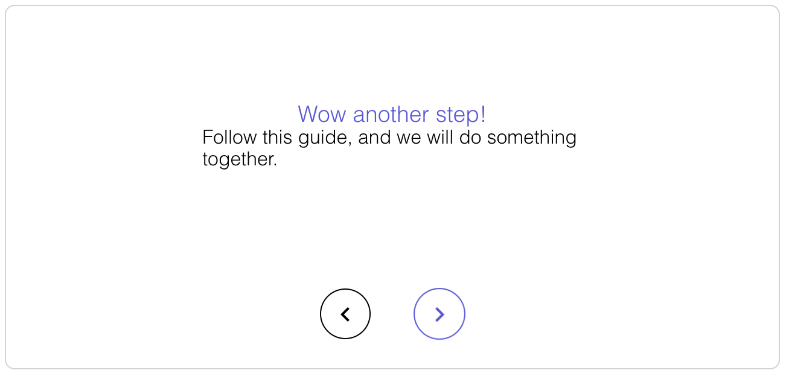

# stepzation
> Javascript library for creating stepable guides, instructions and installations.

> For an example look at the
> [example.html](example.html)

> The original source comes from the content management system I started developing,
> which you can find [here](https://github.com/sebbekarlsson/paste-cms).
> The original source was used when creating the installation guide for the CMS.

## The files
 * **animate.css**  - this is from: https://daneden.github.io/animate.css
 * **example.html** - this is an example on how you could use the library
 * **stepzation.js** - the actual library, load it.
 * **style.css** - do **NOT** use this. This is just used to style the example.
